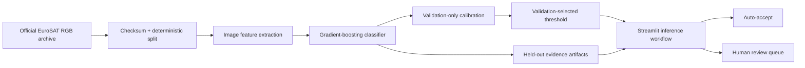

# Architecture and Design Rationale

## Decisions

- **Streamlit:** minimizes integration risk and produces a shareable, polished UI from the same Python inference code.
- **Deterministic features plus gradient boosting:** trains on ordinary hardware, is reproducible inside a short hackathon, and keeps the repository deployable without a large deep-learning runtime.
- **Separate validation and test roles:** calibration and threshold selection use validation data; final claims use held-out test data.
- **Saved evidence artifacts:** the dashboard cannot drift away from the evaluated results.
- **Abstention:** confidence changes the workflow rather than being decorative.

## Scale path

The prototype handles single images and small batches. A pilot would package inference behind a containerized API, store review events in a database, ingest cloud-masked Sentinel-2 tiles, and measure region-specific performance. Throughput projections must be calculated from measured latency and deployment hardware before inclusion in the pitch.

