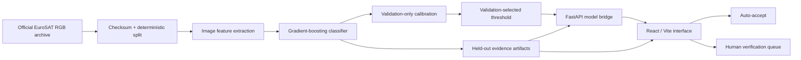

# Architecture and Design Rationale

## Decisions

- **React/Vite + FastAPI:** separates presentation from model inference while retaining a single production URL. The interface can use semantic HTML, responsive behavior, accessible interaction states, and a narrowly scoped animation bundle.
- **Calm management-tool design system:** a compact page frame, warm neutral surfaces, thin rules, restrained serif headings, and one primary accent keep attention on the working review flow. The persisted source of truth is `design-system/terratrust/MASTER.md`.
- **Static product states:** the current React interface does not use animated page transitions. Only loading feedback moves, and reduced-motion preferences are respected through CSS.
- **Deterministic features plus gradient boosting:** trains on ordinary hardware, is reproducible inside a short hackathon, and keeps the repository deployable without a large deep-learning runtime.
- **Separate validation and test roles:** calibration and threshold selection use validation data; final claims use held-out test data.
- **Saved evidence artifacts:** the dashboard cannot drift away from the evaluated results.
- **Abstention:** confidence changes the workflow rather than being decorative.

## Scale path

The prototype handles single images and small batches. A pilot would package inference behind a containerized API, store verification events in a database, ingest cloud-masked Sentinel-2 tiles, and measure region-specific performance. The measured warm local CPU p95 is 22.3 ms per image; this implies a theoretical serial ceiling near 44 images/second before storage, network, and concurrency overhead. The project uses 20 images/second only as a conservative planning assumption—not a deployed capacity claim. Infrastructure, rollout phases, observability, assumptions, and deployment gates are documented in `docs/scalability-plan.md`.
